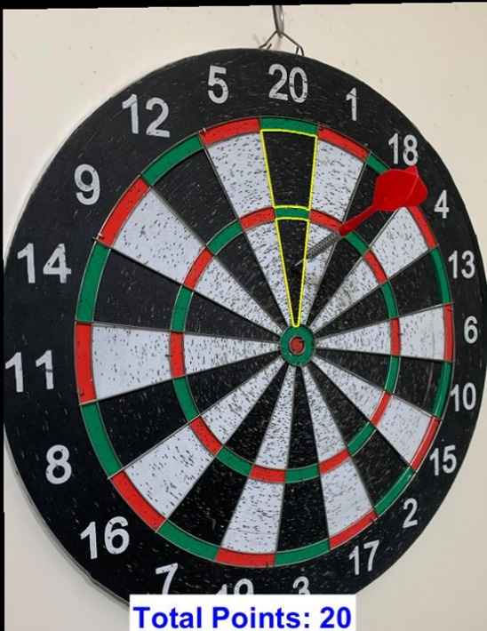
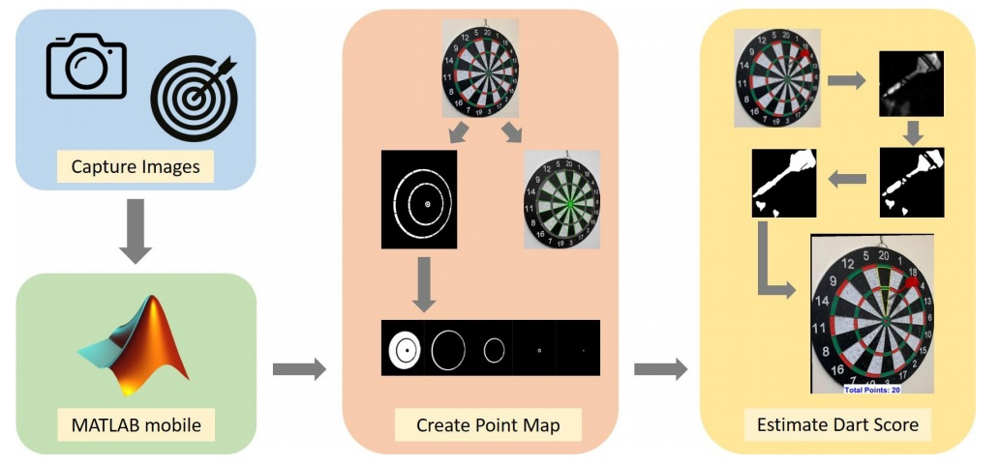
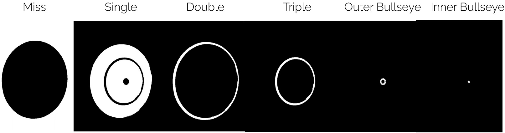
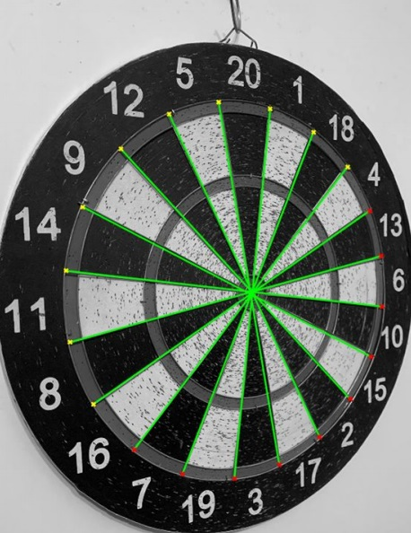
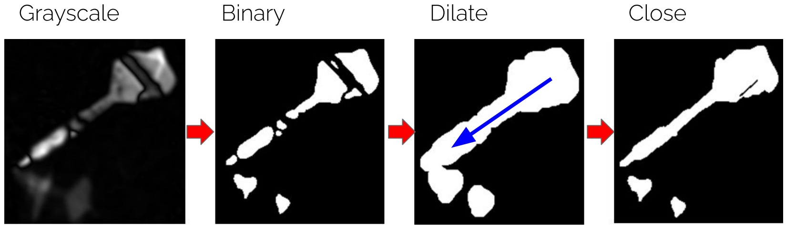

# Dart-Score-Estimation
Estimate dart scores by dart images input using Computer Vision and Digital Image Processing techniques.

Image shown below is one of the demo results of this project.

For more details, please check the [complete project report](src/DSP_Final_Report_Team_10.pdf). :page_with_curl:

Demo video can be found [here](https://www.youtube.com/watch?v=PBdtE5Uq9Ac&ab_channel=MaxSyu). :movie_camera:

Demo slide can be found [here](src/DSP_Final_Slide.pdf). :newspaper:

## Project Intro :dart:

The whole pipelines are broken down into 2 stages:
  * **Region Segmentation**
  * **Dart Location Estimation**
  
## Demo of Project Process :pic:

### Region Segmentation

### Dart Location Estimation

## Environment and Package required :snake:

* MATLAB R2019b
* vl-feat packages for MATLAB (can be downloaded from [here](https://www.vlfeat.org/download.html))

## Future Works :triangular_flag_on_post:

Makes it practical in real life, such as letting users to build their own dataset and safety system, scanning face to unlock certain devices like PC, mobile phone or a gate.
